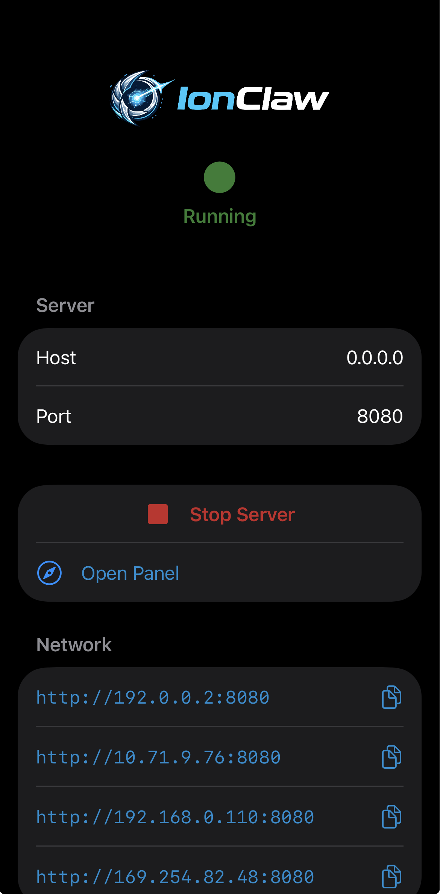
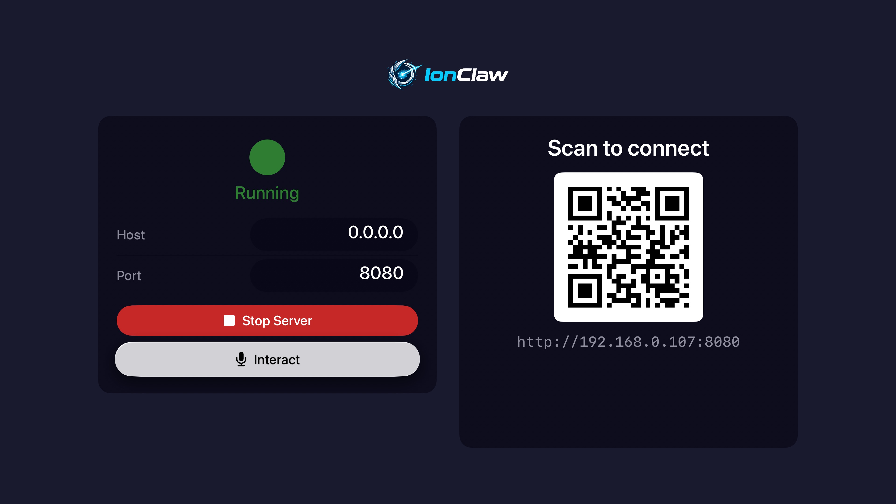
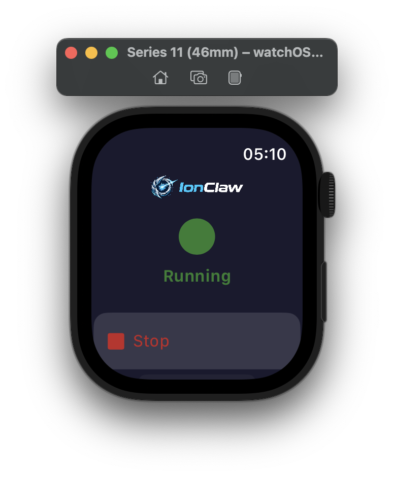

# Screenshots

A few platforms running IonClaw — all powered by the same C++ engine.

## Web Panel

Served by the server and opened in the browser.

    <kbd></kbd>

## Native apps

Native SwiftUI apps that embed the engine and run the server on-device.

### iOS

    <kbd></kbd>

### tvOS

    <kbd></kbd>

### watchOS

    <kbd></kbd>

## Flutter app

The cross-platform Flutter app.

### iOS

    <kbd></kbd>
    <kbd></kbd>

### Android

    <kbd></kbd>
    <kbd></kbd>

### macOS

    

